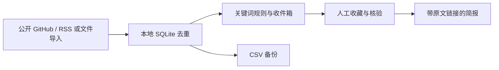

# Intel Board · 本地情报工作台

把 GitHub 更新、RSS 文章、社区导出和优惠线索放进一个本地看板。你可以按关键词筛选、收藏值得跟进的记录、核对原文，然后导出带来源的简报。**数据默认只保存在你的电脑上。**

> A local-first intelligence inbox for GitHub, RSS and imported community records. Collect → triage → verify → export a cited digest. Python standard library + SQLite; no account or API key required for the basic workflow.

## 三分钟体验 / Quick start

需要 Python 3.10+。在项目目录执行：

```bash
python app.py --demo
```

打开 [http://127.0.0.1:8770](http://127.0.0.1:8770)。`--demo` 只在空库中加入三条明确标注的演示记录。正式使用运行 `python app.py`，不会自动生成演示内容。

1. 在“数据源与导入”添加 `https://github.com/cline/cline`，点击“立即采集”。也可以添加 HTTPS RSS/Atom 地址，或导入自己的 CSV/JSON。
2. 在收件箱按关键词找线索；对值得保留的记录点击“收藏”，查看原文后点击“标记已核实”。
3. 在“已收藏”下载 Markdown 简报。简报只包含最近 7 天内收藏且已核实的真实记录。



## 功能

| 功能 | 用途 |
| --- | --- |
| GitHub、RSS/Atom 采集 | 从公开来源抓取最近内容，并记录原始链接和采集状态 |
| CSV/JSON 导入 | 接入你有权使用的聊天记录或历史数据；相同 URL 去重 |
| 收件箱、收藏、归档 | 把大量原始记录逐步缩成待处理清单 |
| 关注规则 | 用包含词、排除词和平台筛出关注主题 |
| 人工核验与备注 | 明确区分原文、社区说法和人工确认结果 |
| Markdown 简报、CSV 备份 | 分享结果与迁移个人数据 |
| 作者贡献量 | 看发布数量；**不**把发帖数当可信度分数 |

默认只监听 `127.0.0.1`。可设置 `INTEL_PORT` 和 `INTEL_DB` 环境变量修改端口与数据库路径。定时采集可以通过操作系统任务计划运行：

```bash
python app.py --fetch-all
```

## 导入格式

CSV 首行或 JSON 对象数组使用下列字段：`type`（`message`、`link`、`intel`、`deal`）、`title`、`summary`、`url`、`platform`、`author`、`published_at`、`category`、`confidence`、`verified`、`tags`。至少需要 `type` 与 `title`。

```csv
type,title,summary,url,platform,author,published_at
intel,Example release,Check the original announcement,https://example.org/post,Example,editor,2026-09-28
```

单次上传上限 5 MB。对于更多历史数据，可拆分文件导入；重复记录会跳过。不要把私人聊天记录或 `intel.db` 提交到公开仓库。

## 测试与贡献

```bash
python -m unittest discover -s tests -v
```

见 [贡献指南](CONTRIBUTING.md) 与 [市场验证说明](MARKET_VALIDATION.md)。发现问题或希望接入新的公开来源，欢迎创建 Issue。若这个工具确实帮你省下查找与整理时间，可以给仓库一个 Star，让更多有同样问题的人发现它。

## 边界

项目不会凭空获得截图里的约 4 万条消息或 22 个私有社区的数据。相关平台需要你提供合法导出文件或有权使用的接口。公开 API 有速率限制；优惠条件和产品政策需回到官网核实。当前版本是单机工具；若要部署到公网，需要先加入身份验证、访问控制与更严格的采集隔离。

## License

MIT。详见 [LICENSE](LICENSE)。
